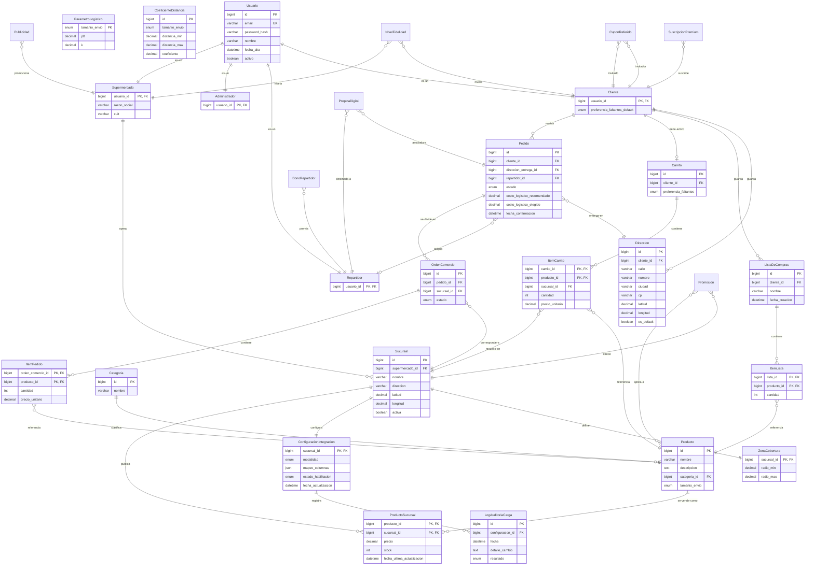

# Modelo de Objetos

Diagrama Entidad-Relación consolidado de Changuito (in scope del TPI y backlog de producto).

## Diagrama C4

El diagrama C4 completo de Changuito (contexto, contenedores, componentes, objetos y secuencia de checkout) está disponible en el siguiente enlace:

[Diagrama C4 — Changuito](https://drive.google.com/file/d/1O-L8HVnFP8NCRYejGcBwjPALR3OmM801/view?usp=sharing)
